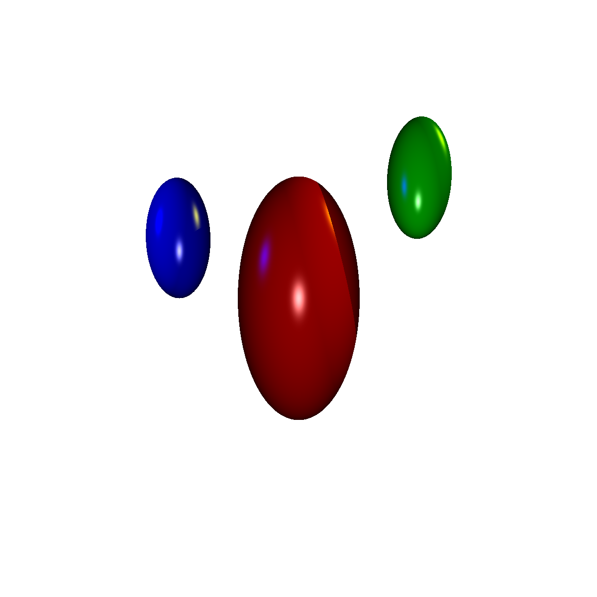

# C++ Raytracer
A very simple raytracer written in C++ as a final project for EECS 3431 (Introduction to 3D Computer Graphics).

<p align="center">
    
</p>

## Features
Renders to a ppm a scene with the following characteristics:
* Up to 15 spherical objects (sphere or ellipsoid)
* Up to 10 lights
* Background colour
* Ambient colour
* Multithreading support

The algorithm is a very similar but different application of the Phong reflection model (more can be read [here](https://en.wikipedia.org/wiki/Phong_reflection_model)). The number of reflection rays per pixel is no more than 3.

## Planned Features
* CUDA accelerated rendering
* Render to a more web friendly image format
* More shapes
* More unit tests

## Changelog (2019-08-19)
* Improved multithreading performance (~25%)
* Cleaned up redundant code
* View fustrum parameters were deprecated. Aspect ratio is automatically calculated

## Compilation
Clone repository and build in debug or release (x86 or x64) using Visual Studio 2017. Compiling in debug mode will also build the test project. Note: Currently the test inputs are copied to the output directory **regardless** of debug/release.

## Usage
```
raytracer.exe <filename> -multi
```
```filename``` must be a .txt file, contain the following, and the **parameters are case sensitive**. Order of each parameter does not matter. If a parameter is repeated, the most recent occurence takes precedence:

```-multi``` Optional. Enables multithreading support and allocates threads relative to the number of hardware threads on your computer. Average performance gains of between 3x-5x. Scales best for larger images.
```
NEAR <n**>
~~LEFT <l**>~~
~~RIGHT <r**>~~
~~BOTTOM <b**>~~
~~TOP <t**>~~

RES <x*> <y*>

SPHERE <name^> <x**> <y**> <z**> <scl x**> <scl y**> <scl z**> <r***> <g***> <b***> <ka***> <kd***> <ks***> <kr***> <n*>

LIGHT <name^> <x**> <y**> <z**> <r***> <g***> <b***>

BACK <r***> <g***> <b***>
AMBIENT <r***> <g***> <b***>
OUTPUT <name^>
```
*\* int* | *\*\* float* | *\*\*\* float between 0 and 1* | *^ string*

Examples can be seen in ```RaytracerTest/input/```


### Explanation for parameters
The near plane is defined as:
* The absolute distance along the negative z-axis ```n```
* ~~The view frustrum ```left, right, top, bottom```~~
* The render resolution in ```x columns, y rows```

The sphere has the following parameters (In order):
* An identifiable name for the object ```name```
* Position (in 3d space) ```x, y, z```
* Scale (in 3d space) ```scl x, scl y, scl z```
* The colour of the object ```r, g, b```
* The ambient reflection constant ```Ka```
* The diffuse reflection constant ```Kd```
* The specular reflection constant ```Ks```
* The reflection constant ```Kr```
* The specular exponent ```n```

The light has the following parameters (In order):
* An identifiable name for the object ```name```
* Position (in 3d space) ```x, y, z```
* Light Intensity ```r, g, b```

The background colour ```r, g, b```  
The ambient intensity ```r, g, b```  
The name of the output file ```name```

```names``` are limited to 20 characters, with no spaces. All parameters are separated by spaces. There are no brackets in the input file (they are to clarify what each type is each parameter).

### The application will not render if:
* You do not specify a near plane, resolution, or ~~frustrum~~
* You do not specify a background colour
* You do not specify an ambient light intensity

The executable is compiled for Windows with Visual C++17 as specified in the requirements of the assignment.

** The Windows target platform was changed to 10.0.18362.0 and may or may not work with VS 17**

## Licenses
The project itself is licensed under GPLv3 and makes use of:
* [Catch2](https://github.com/catchorg/Catch2)
* [OpenGL Mathematics (GLM)](https://github.com/g-truc/glm)
